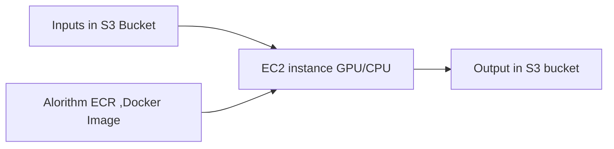

# Primary objective of this repository is to:

1. Containerize the face train
1. Register the created Docker image to AWS ECR
1. Trigger a traning job using python script **training_job.py**




# Build Docker image and push to ECR
## Dockerfile

The `Dockerfile` contains basic configurations required to create Docker image. It constructs environmental varibales (PATH, WORKDIR), copy all the files to WORKDIR, installs software dependencies from `requirement.txt` and creates executable for training, `train`.

## build-and-push.sh

The script `build-and-push.sh` is driving script for `Dockerfile` to create the docker image on the sagemaker notebook instance using sagemaker credentials and pushes to Amazon ECR (Elastic Container Registry). 

The user must have sagemaker access to create repositories to AWS-ECR and full ECR access roles to execute this command

```bash
./build-and-push.sh <name-of-docker-image> 
```

for example, if you want to create an docker image with the name "amniscient-face-training" one should use the following

```bash
./build-and-push.sh amniscient-face-training
```
This script creates the image uri and stores it in a txt file

    "ecr_image_fullname.txt"

This uri is used in triggering the training job.

<!---
# Docker image
    
In the folder container, the Dockerfile is used to build the yolo image for training.

This file uses the latest yolo repo at the time of model building "branch v6.2" for training
    
If one wishes to update or downgrade the yolo repo, change the line 17 to desired tag. For example:
    
```bash
git clone --branch v6.2 https://github.com/ultralytics/yolov5 -> git clone --branch v4.2 https://github.com/ultralytics/yolov5
```
-->


# Training job

## Dependencies and SageMaker env

First requirements :

Make sure you have an AWS IAM Role capable of running SageMaker job and having read/write access to the S3 buckets that contains :

  - ArcFace pretrained model, face landmark file and inputs
  
  - data set images and labels
  

For this code we will be using the sagemaker access role
<!---
## 2. Download yolo model with pretrained weights

In this example you can either use yolov5 small or large. But you can download other flavor from the yolov5 project, and adjust the training inputs accordingly

```bash
wget https://github.com/ultralytics/yolov5/releases/download/v6.2/yolov5s.pt -O ./yolo-inputs/input/data/weights/yolov5s.pt
wget https://github.com/ultralytics/yolov5/releases/download/v6.2/yolov5l.pt -O ./yolo-inputs/input/data/weights/yolov5l.pt
```  
--->

## Archive yolo configuration items and push them to S3

### Job configuration 

in local folder 'yolo-inputs' :

  - make sure that in input/data/weights you can find the preweighted model you want to use for the transfer learning
  
  - make sure that in input/data/cfg you can find the yolo model configuration file related to the preweighted model you want to use. If not file are available here : https://github.com/ultralytics/yolov5/tree/master/models
  
  - make sure that in input/data/cfg you can find the yolo model hyperparameter file. If not file are available here : https://github.com/ultralytics/yolov5/tree/master/data/hyps
  
  - in input/data/cfg/train-args.json adjust the training job parameters (number of epochs, batch size, preweighted model name)
  
  - in input/data/cfg/amniscient.yaml adjust the number of object categories and their name (nc and names). train and val path must remain as they are : docker volume are mounted to these path.
  
### Job configuration input upload

You now need to upload the content of 'yolo-input' into one of your S3, within a folder structure named 'sagemaker_training_jobs/yolo-inputs'

## Define the training job cfg file locations on s3

Deep dive code and instuctions can be found in the 

    "training-job.ipynb"

Set the S3 locations for training jobs for example:

```python
bucket = "sagemaker-studio-833537904510-3lvvbxobayc"
s3_input = 's3://{}/sagemaker_training_jobs/yolo-inputs'.format(bucket)
s3_images = "s3://sagemaker-studio-833537904510-3lvvbxobayc/Rajiv_Backup/yolov5_test/datasets/amniscient_images/images" # Images files are here, in a subfolder named 'train'
s3_labels = "s3://sagemaker-studio-833537904510-3lvvbxobayc/Rajiv_Backup/yolov5_test/datasets/amniscient_images/labels" # Label files are here, in a subfolder named 'train'

cfg='{}/input/data/cfg/'.format(s3_input)
weights='{}/input/data/weights/'.format(s3_input)
outpath='{}/results/'.format(s3_input)

images='{}/'.format(s3_images)
labels='{}/'.format(s3_labels)
```

## 5) Trigger a training job

Now we can trigger the training job using the sagemaker utilities. This can be done with right IAM roles for sagemaker.

```python
from sagemaker.session import TrainingInput

inputs = {
    "cfg": TrainingInput(cfg),
    "images": TrainingInput(images),
    "weights": TrainingInput(weights),
    "labels": TrainingInput(labels),
}

estimator = Estimator(
    image_uri=container,
    role=role,
    instance_count=1,
    instance_type='ml.p3.2xlarge',
    # instance_type='local',
    input_mode='File',
    output_path=outpath,
    base_job_name='amniscient-yolov5-1'
)

estimator.fit(inputs)
```
