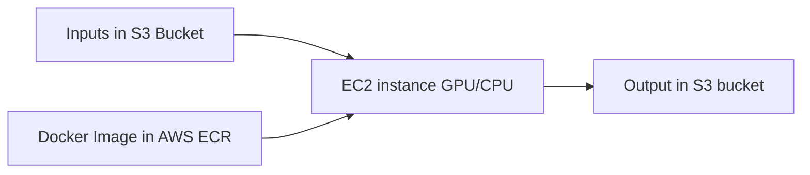

# Introduction
The repository contains code framework related to the SMT (SageMaker Training) job for face recogintion. Following are the basic steps for the process;

1. Containerize the face train requriments with Docker image
1. Register the created Docker image to AWS ECR
1. Trigger a traning job using python script **training_job.py**



First, we need to make sure you have an AWS IAM Role capable of running SageMaker Training job and having read/write access to the S3 buckets contiaining input/output files.

# Build Docker image and push to ECR
## Dockerfile

The `Dockerfile` contains basic configurations required to create Docker image. It constructs environmental varibales (PATH, WORKDIR), copy all the files to WORKDIR, installs software dependencies from `requirement.txt` and creates executable for training, `train`.

## build-and-push.sh

The script `build-and-push.sh` is driving script for `Dockerfile` to create the docker image on the sagemaker notebook instance using sagemaker credentials and pushes to Amazon ECR (Elastic Container Registry). 

The user must have sagemaker access to create repositories to AWS-ECR and full ECR access roles to execute this command

```bash
./build-and-push.sh <name-of-docker-image> 
```

for example, if you want to create an docker image with the name "amniscient-face-training" one should use the following

```bash
./build-and-push.sh amniscient-face-training
```
This script creates the image uri and stores it in a txt file

    "ecr_image_fullname.txt"

This uri is used in triggering the training job.

# Set up S3 for input/output and configuration files
The input images and configuration files for the training should be uploaded in the Amason S3 bucket. Thus uploaded files/repo are mounted as `/opt/ml/<input_repo>` in the EC2 where training job is ran. Also, all the ouputs from the training job should be saved to /opt/ml/<output_rep> in EC2. After the completion of the training job, the output files (.tar foramt) are copied back to S3 bucket. 

The following S3 bucket is used for the training job. 

```
bucket = "sagemaker-studio-833537904510-3lvvbxobayc"
```
The image files of the employees are stored in `s3://<bucket>/amni_face_train/face_imgs/`.

The configuration files i.e. `constants.py` is stored in `s3://<bucket>/amni_face_train/cfg/`.

Finally, the output files; `final_mean_embeddings.csv, rules.py, saved_embeddings.pkl` are copied back to `s3://<bucket>/amni_face_train/results/`.

The `training_job.py` is the main script with sets up the configuration and instuctions for the training. Following is the snippet of the script which sets S3 location for training job.

```python
bucket = "sagemaker-studio-833537904510-3lvvbxobayc"

with open (os.path.join('ecr_image_fullname.txt'), 'r') as f:
    container = f.readlines()[0][:-1]

s3_input = 's3://{}/amni_face_train'.format(bucket)

cfg='{}/cfg/'.format(s3_input)
outpath='{}/results/'.format(s3_input)
images='{}/face_imgs/'.format(s3_input)

```


#  Trigger a training job

Now we can trigger the training job using the sagemaker utilities. This can be done with right IAM roles for sagemaker.

```python

# Job configuration
from sagemaker.session import TrainingInput

inputs = {
    "cfg": TrainingInput(cfg),
    "face_imgs": TrainingInput(images),
}

estimator = Estimator(
    image_uri=container,
    role=role,
    instance_count=1,
    instance_type='ml.m5.large',
    # instance_type='local',
    input_mode='File',
    output_path=outpath,
    base_job_name='amni-face-train'
)

estimator.fit(inputs)
```

The following command will start the training job;

```
python training_job.py
```

# Step Function
.....
